## 概述

### 链路层服务

- `成帧` 将网络层数据报封装成链路层 `帧` , 为了检测和纠正物理层的比特错误

- `可靠交付` 提供在差错链路上纠错错误

- `差错纠正` 由信号 `衰减` 和电磁噪声导致的比特差错

  - `差错` 数据发生错误 -- 进行差错校验

  - `丢失` 接收方未收到 -- 启用定时器, 超时重传

  - `乱序` 先发后到, 后发先到 -- 检查序列号, 防止乱序和重复

  - `重复` 一次发送多次接收

- `流量控制` 确保发送方发送速率不大于接收方处理速率

  - 基于 `反馈` -- 接收方反馈, 发送方调整

  - 基于 `速率` -- 发送方根据内建机制, 自行限速

- 为网络层提供

  - 无确认的无连接服务

  - 有确认的无连接服务

  - 有确认的面向连接服务

  

### 链路层主体

网络适配器(软硬件结合体)

### 链路层功能

- `链路管理` 链路层连接的建立、维持、释放过程

- `帧定界` `帧同步` `透明传输`

- `流量控制` 控制相邻节点数据链路间的流量

  - `停止-等待流量控制` 发送后等待应答信号, 没收到信号就一直等

  - `滑动窗口流量控制` 发送方和接收方维护一组连续的允许发送/接收的 `帧序号` , 只有符合要求的序号能被发送/接收, 且只有接收窗口移动, 发送窗才移动

- `可靠传输` 确认和超时重传

- `差错控制`

## 差错检验

### 两种策略

- `检错码`

  - 只能知道有错误, 不能知道哪里有错, 出错了就重传

  - 主要用在 `高可靠` `误码率低` 的信道上

- `纠错码`

  - 能够判断是否有错, 也能纠正错误

  - 主要用于频繁发生错误的信道上

  - 通常也成为 `前向纠错(FEC)`

### 相关概念

- `码字` 也称为 `(n,m)码` , 表示 `m` 个数据位, `n-m` 个校验位

- `码率` 数据位比例, `m/n`

- 海明距离

  - 为了检测出 `d` 个错误, 需要海明距离 `d + 1` 的编码

  - 为了纠正 `d` 个错误, 需要海明距离 `2d + 1` 的编码

  :::tip 海明距离

  两个字符串对应位置的不同字符的个数, 如:

  - 1011101 与 1001001 之间的汉明距离是 2

  - 2143896 与 2233796 之间的汉明距离是 3

  :::

### 偶校验

- 包括校验位, 存在偶数个 `1`

- `存在问题` 若存在偶数个差错无法检测出来

### 二维偶校验

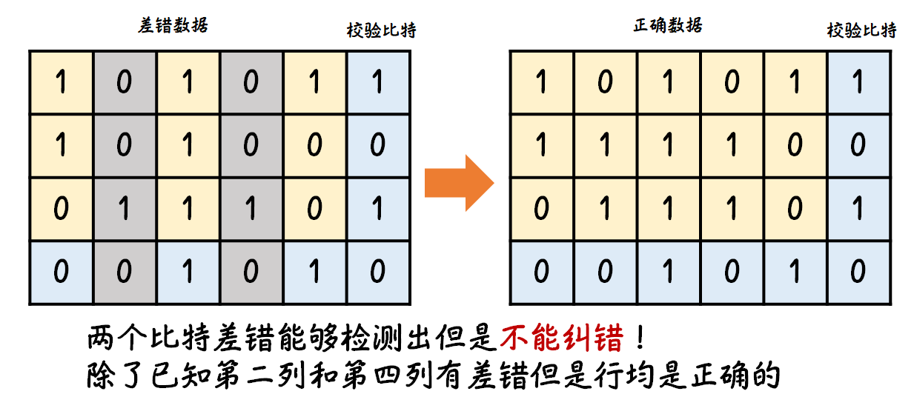

### 检验和

校验和与数据进行求和, 结果为 `11...1` 则无错误

### 循环冗余

`CRC` `多项式编码`

- 发送方与接收方事先商定一个 `生成多项式G` (最高位和最低位均为 `1` ) 作为 `除数`

  - 如多项式 G = 2⁵ + 2³ + 2² + 2 + 1 可以写成 101111(47)

- 要发送的数据作为被除数 M

- `余数R` 即帧检验序列 `FCS` `冗余码`

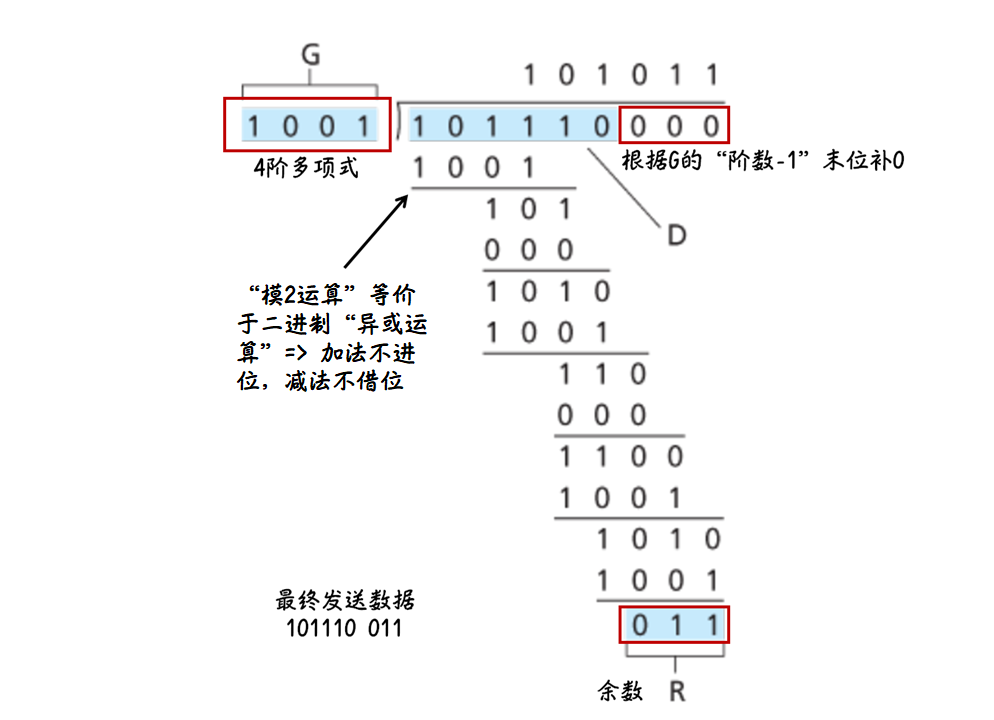

#### 检错原理

- 接收端使用接收到的数据除以 `G` , `余数` 为 `0` 则未出错

- 计算的时候有余数, 数据补上余数后再除就不会有余数

### 海明码

根据上图可知, 进行偶校验时, 发送的数据为 `100110101001101`

当第 7 个数据出错时, 可以定位错误地点

## 多路访问

### 信道划分协议

- `时分复用(TDM)`

  - 传输带宽固定为 `R bps`

  - 数据分组在特定的时隙(时间段)中传输

  - 即使只有一个分组, 也要在特定时隙中传输

  - 可用于数字传输

  

- `频分复用(FDM)`

  - 将 `R bps` 的信道分成不同的频段, 每个频段占据 `R/N` 带宽

  

- `码分多址(CDMA)` 给每个节点分配不同的编码

  - 发送方利用唯一编码对数据进行编码, 接收方利用相同的编码对数据进行解码

    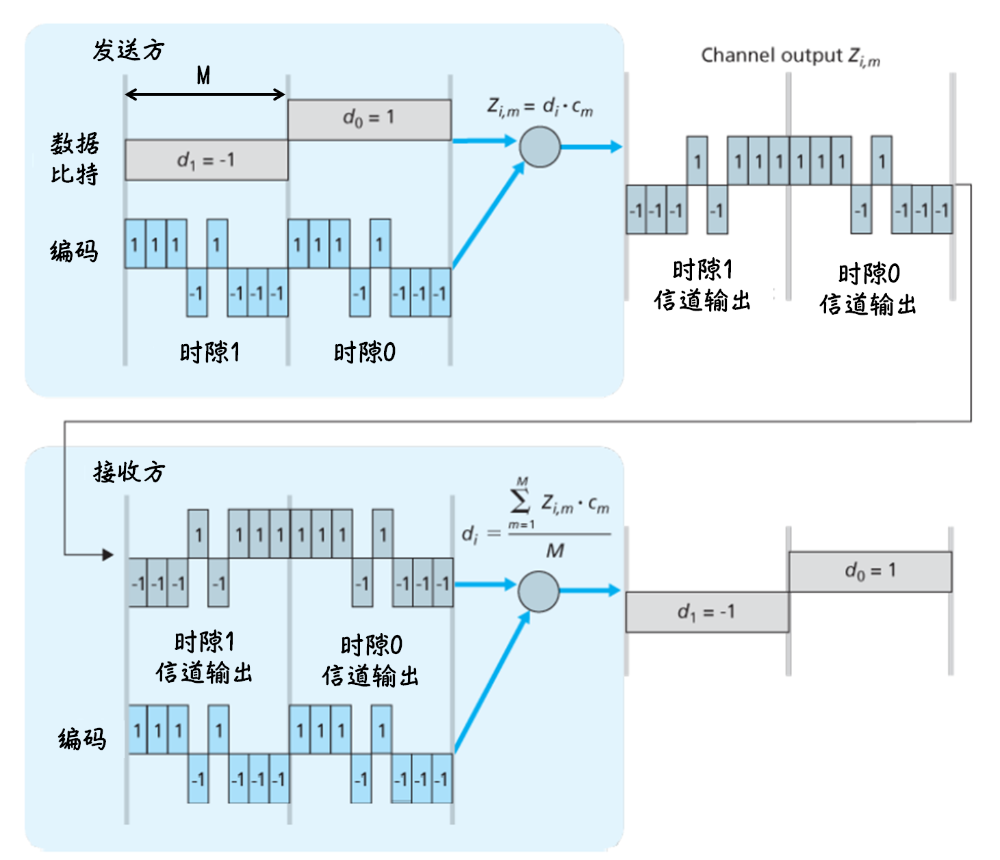

  - 多个分组可以同时传输

    

  

### 随机接入协议

- `想发就发`

- 涉及碰撞的节点 `反复重发` 送该帧, 直到无碰撞为止

- 重发该帧前随机等待一段时间, 即 `随机时延`

#### 纯 ALOHA 协议

- 发送数据时 `不需要任何检测` 就立即发送( 随意性 )

- 如果发生碰撞, 则以概率 `p` 进行重发

- 最大效率 `1/(2e)`

#### 时隙 ALOHA 协议

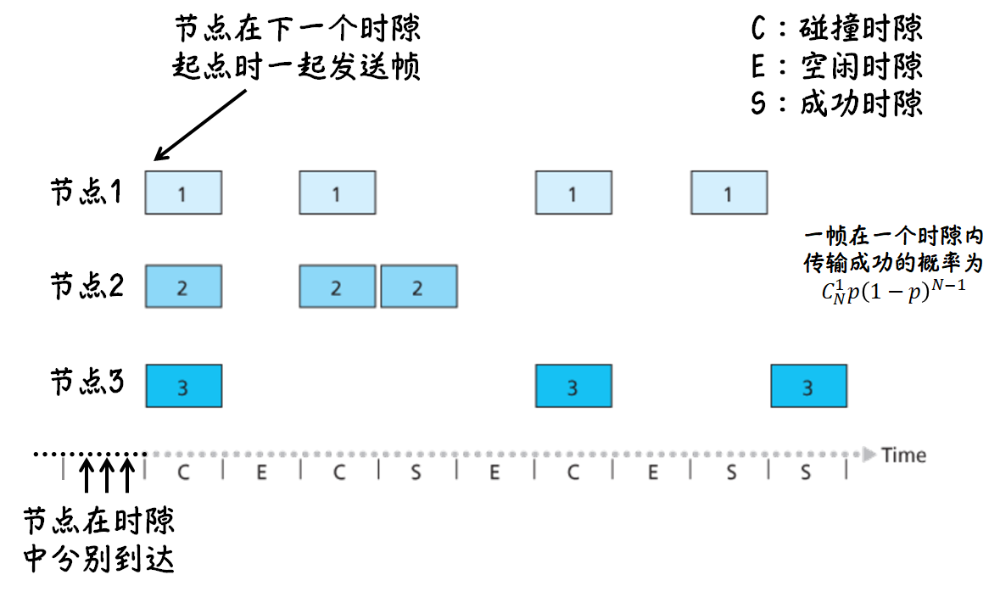

- 帧为 `L` 比特, 将时间划分为一个个长度为 `L/R(带宽)` 的时隙

- 只有在时隙 `起点` 才能发送帧( 避免了帧发送的随意性 )

- 节点会在时隙结束前检测到碰撞

- 最大效率 `1/e`

### 载波侦听多路访问协议

- `CSMA` 发送数据前监听信道空闲情况

- `先听后发`

#### 坚持 CSMA

- 监听到信道空闲就立即发送, 监听到不是空闲就等待( 持续监听 )

- 存在问题
  - 信号传播存在延迟, 某节点没监听到正在传播的信号
    
  - 即使不考虑时延, 两个站点都要发送数据时, 都在等待信道变空闲, 一旦监听到信道空闲后就会同时发送

#### 非坚持 CSMA

- 监听到信道空闲就立即发送, 监听到不是空闲就放弃监听, `随机等待` 一会再监听

- 解决了 `同时发送` 的问题, 因为检测到信道忙时就会随机等待一段时间, 因此不太可能同时检测到信道空闲

- 缺点是大家一起等待的时间内介质是空闲的

#### p-CSMA

- 信道忙就不发送

- 信道空闲就以概率 `p` 发送数据

- 存在 `1-p` 的概率不发送, 等到下一个时隙再以概率 `p` 发送

#### CSMA/CD

`碰撞检测` `1-持续` `先听后发, 边听边发`

- 发送数据的 `同时` 对信道进行 `监听`

- 检测到碰撞后就停止发送数据, 等待一定时间再发送

- `争用期` A 在发送帧后 `至多` 经过 `2τ(δ→0)` 即可知道数据碰撞了

  

  :::info

  `τ` 端到端传播时延

  :::

  

  - 当超过争用期未收到碰撞信号, 说明之后都不会碰撞了

  - 发送的数据长度至少要长到等到争用期结束才能发完的程度( 不足的填充 ), 否则数据发完以为成功了, 结果过一会发现碰撞了

    

- 等待的时间间隔采用 `二进制指数后退` 算法计算

  - 一个基本退避时间, 一般取争用期 `2τ`

  - 一个参数 `k` , 其中 `k=min(重传次数, 10)`

  - 从 $[0,1,2,...,2^k-1]$ 中随机取出一个数 `r` , 其退避时间就为 `2rτ`

  - 重传 `16` 次不成功就向上层抛出错误

  

  

#### CSMA/CA

`碰撞避免` 用于无线局域网

- 无线局域网不能用 CSMA/CD

  - 无线介质信号强度动态变化范围大, 不断监听硬件消耗大

  - 无线信号可向任意方向传播, 但传播距离受限, 因此存在隐藏站和暴露站问题

  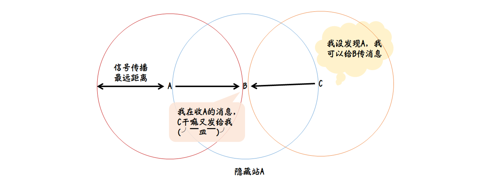

  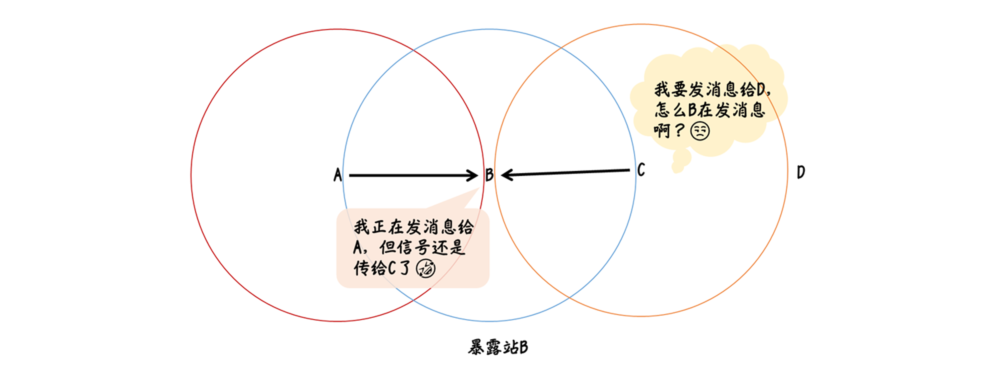

### 受控访问协议

#### 轮询协议

选一个节点为 `主节点` , 主节点监听信道, 主节点通过发送报文告知其他节点可不可以发数据

#### 令牌传递协议

- 令牌是一个特殊帧, 持有令牌才能发送数据

- 一个节点获得令牌, 如果没有数据要发就立即发给下一个站点, 如果有数据要发, 则发完后再产生新的令牌传递给下一个站点

- 网络空闲时, 环路中只有令牌在传递

- 令牌存在持有时间

#### 位图协议

- 有多少个站点, 则争用期就有多少个时隙

- 谁希望获得信道, 则将对应时隙设置成 1

- 按照时隙顺序进行发送

#### 二进制倒计数协议

- 要使用信道的站点广播其二进制地址

- 从高位开始, 通道对地址进行布尔 `或运算`

- 第一轮 `0010` 和 `0100` 地址较小, 则第二轮时放弃竞争, `1001` 在第三轮时发现地址较小, 则第四轮时放弃竞争

- 信道使用结束, 开始下一轮竞标

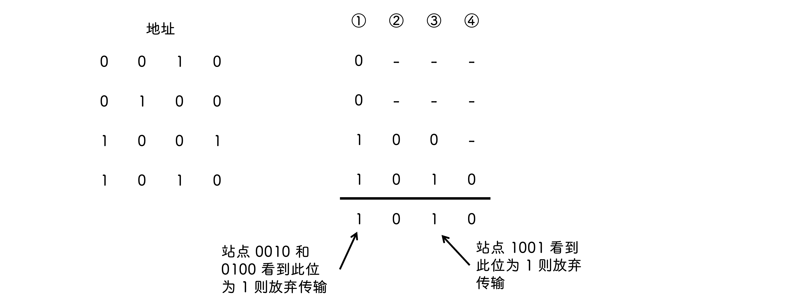

#### 自适应树搜索协议

- 只有一个站点竞争, 则获得信道

- 多个站点竞争, 则下一个时隙, 有一半站点参与竞争, 另一半等到下下个时隙

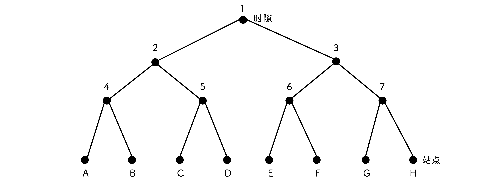

## 局域网(LAN)

在一个较小的地理范围内, 将各种设备通过双绞线、同轴电缆等介质连接起来

### 三要素

- 拓扑结构

  - 星形结构

  - 环形结构

  - 总线形结构

  - 星形-总线型复合结构

  

- 传输介质

  - 双绞线

  - 铜缆

  - 光纤

- 介质访问控制方式

  :::info

  无论何种拓扑结构, 其共同点都是共享一根信道, 因此需要访问控制来解决多个站点同时请求占用信道的问题

  :::

  - CSMA/CD

  - 令牌总线

  - 令牌环(主要用于环形局域网)

  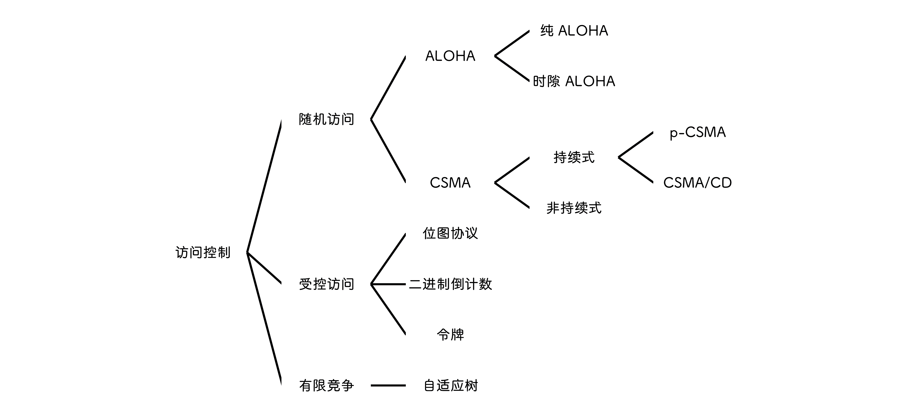

### 以太网

- 以太网帧

  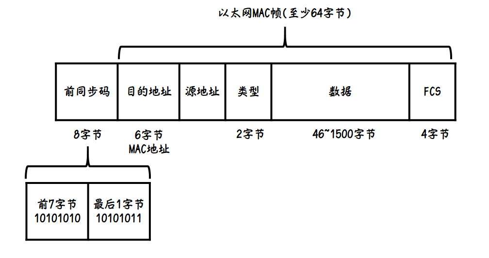

  - `802.3` 协议规定最大帧 `1518(1500+18)`, 最小帧 `64(46+18)`

  - `目的地址` `源地址` 都是 `6` 字节

  - `数据段` 以太网最大传输单元 `MTU` 为 `1500` 字节

  - [`类型`](https://www.iana.org/assignments/ieee-802-numbers/ieee-802-numbers.xhtml) 允许以太网复用多种网络层协议

  - `前同步码` 前 `7` 字节用于唤醒接收适配器, 将时钟与发送方同步, 最后 `1` 字节告诉适配器重要的内容要来了

  - 以太网是 `无连接` 的, 不可靠的交付, 提供了错误检测( 但不修复 )

- 某帧若未通过 `CRC` 校验, 适配器会将其丢弃

  - 应用层表现为 `丢包`

  - 以太网向网络层提供 `不可靠` 服务

- 以太网 MAC 帧由于采用 `CSMA/CD` 协议, 因此最低长度为 `64` 字节

- `5-4-3 规则` 10M 以太网中, 网络总长度不得超过 5 个区段, 4 台网络延长设备, 且 5 个区段中只有 3 个区段可接网络设备

### 交换机

- 接收链路层帧并将其 `转发` 出链路

- 交换机对于子网中的主机/路由器是 `透明的`

  - 主机/路由器不知道它们的数据是经过交换机转发的

- 路由器是网络层的分组交换机

- 交换机能分割冲突域, 而路由器分割广播域

#### 集线器与交换机

#### 自学习

- 初始交换机表为 `空`

- `接口1` 收到数据, 根据其中的 `目的MAC地址` 发现其在 `交换机表` 中的接口是 `接口1` , 无需转发, 直接丢弃

  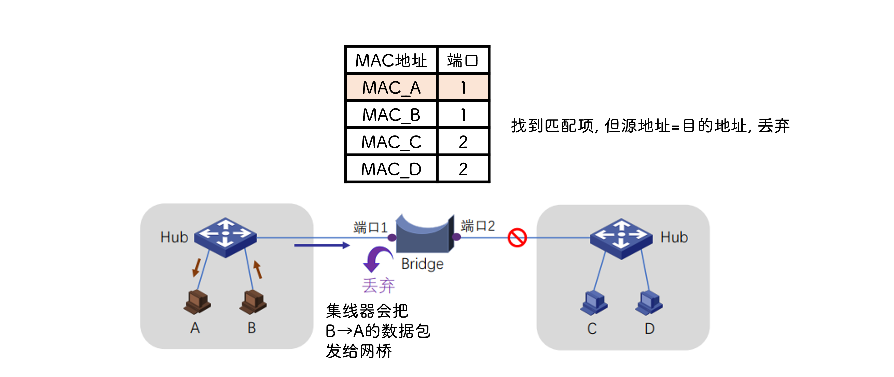

- `接口2` 收到数据, 根据其中的 `目的MAC地址` 发现其在交换机表中 `不存在` 目的接口, 则对除了 `接口2` 外的其他接口广播

  

- 从 `接口2` 收到数据时, 就把 `接口2` 和 `源地址` 存入表中, 说明通过 `接口2` 可以找到源地址

  :::tip

  源地址将来可能作为目的地址, 因此自学习也成为逆向学习

  :::

- 在 `老化期(默认300s)` 后没收到该源地址的数据, 就把其从表中删掉

#### 优点

- `消除碰撞` 交换机会 `缓冲帧` 并且不会同时传输多个帧

- `异质链路` 链路彼此隔离, 不同链路以不同速率运行

  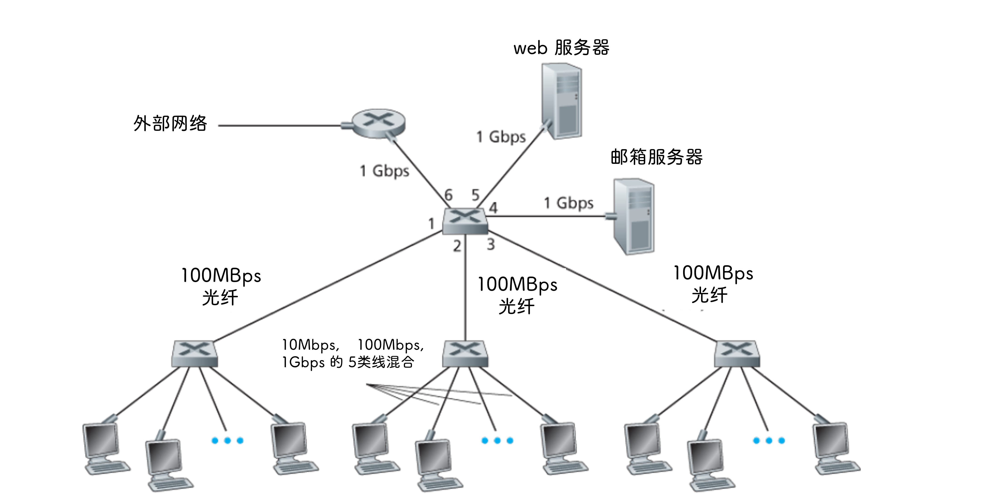

- `管理` 交换机能够检测到异常适配器并主动断开

## 广域网(WAN)

### PPP 协议

`面向字节` 通过 `拨号` 或 `专线` 方式建立点对点的连接发送数据

#### 组成部分

- `链路控制协议(LCP)` 建立、配置、测试和管理数据链路

- `网络控制协议(NCP)` 为网络层协议建立和配置逻辑连接

- `将 IP 数据报封装到串行的方法`

#### PPP 帧

- `协议段` 运载的数据报是什么类型的

  - 以 `0` 开始的是 `IP` `IPX` `AppleTalk` 等网络层协议
  - 以 `1` 开始的用来协商其他协议, 如 `LCP` `NCP`

- `标志段(F)` 前后各占 `1` 字节

- `地址字段(A)` 占 `1` 字节

- `控制字段(C)` 占 `1` 字节

#### 状态图

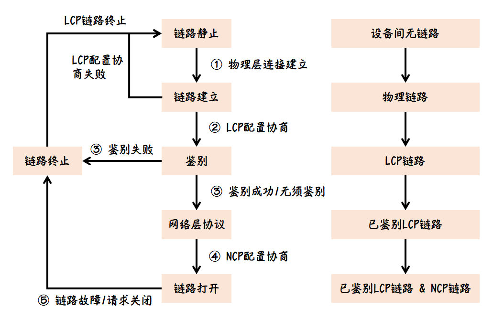

- PPP 提供差错检测(CRC 检验), 但没有纠错功能, 为 `不可靠` 传输协议

- 仅支持点对点的链路通信、全双工链路

#### PPPoE

- 提供在以太网链路上的 PPP 连接

- 提供了身份验证、加密、压缩等功能

- 基于用户的访问控制、计费、业务类型分类等, 运营商广泛支持

- Client/Server 模型

### HDLC 协议

`高级数据链路控制` `面向比特`

- `传输方式` 存储转发

- `站`

  - `主站` 负责控制链路 `命令帧`

  - `从站` 按主站命令操作 `响应帧`

  - `复合站` 既有主站又有从站功能 `命令帧、响应帧`

- `基本配置`

  - `平衡模式` 链路两端是复合站

  - `非平衡模式` 由一个主站控制整个链路

- `数据操作方式`

  - `正常响应` 非平衡, 主站向从站传数据，从站得到主站许可才响应传输

  - `异步平衡` 平衡, 复合站可以向另一个复合站传数据

  - `异步响应` 非平衡, 从站不需要主站许可即可传输

