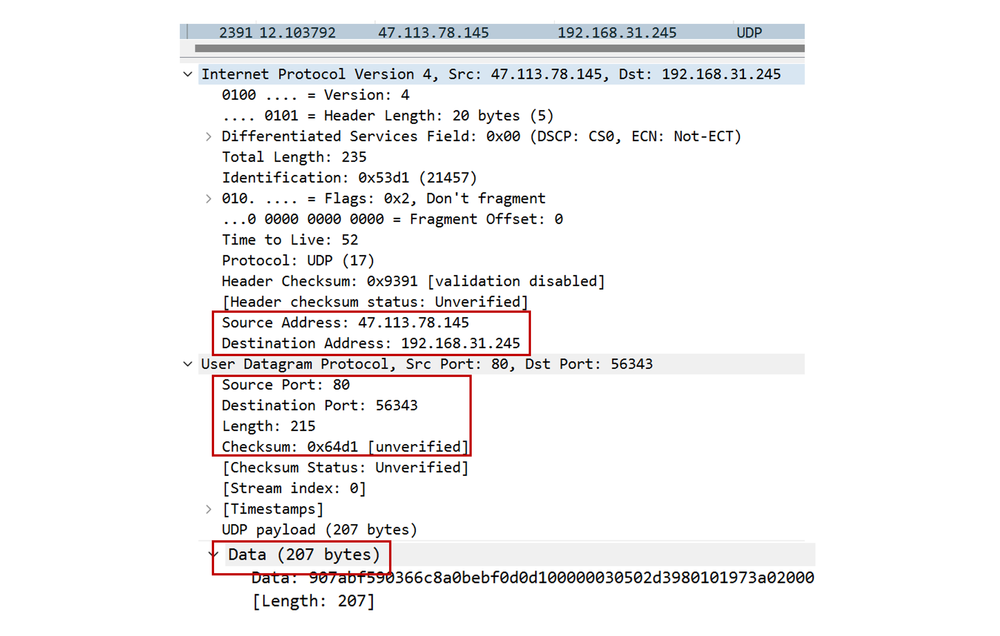
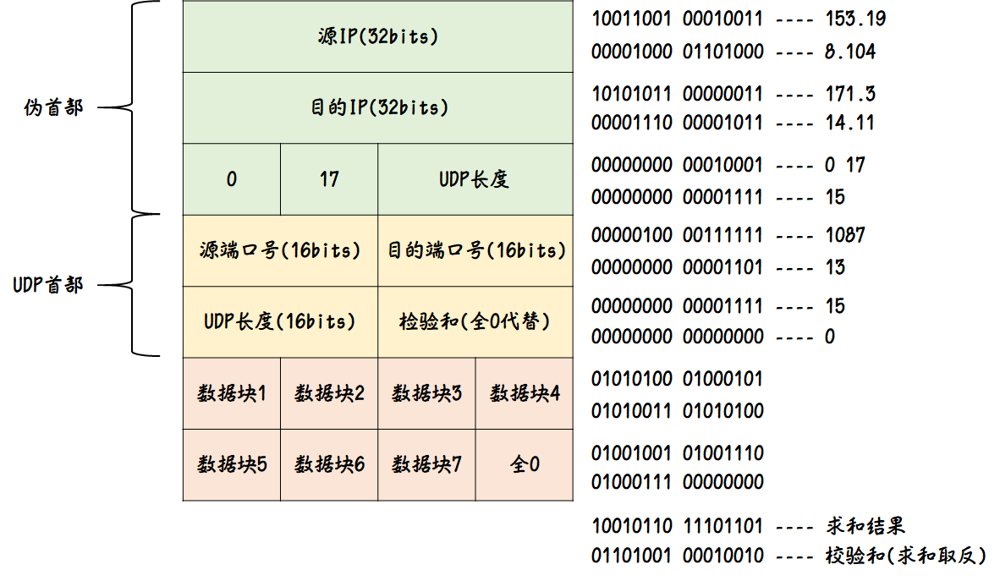
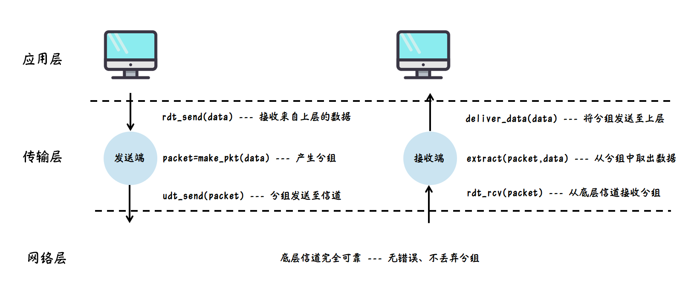
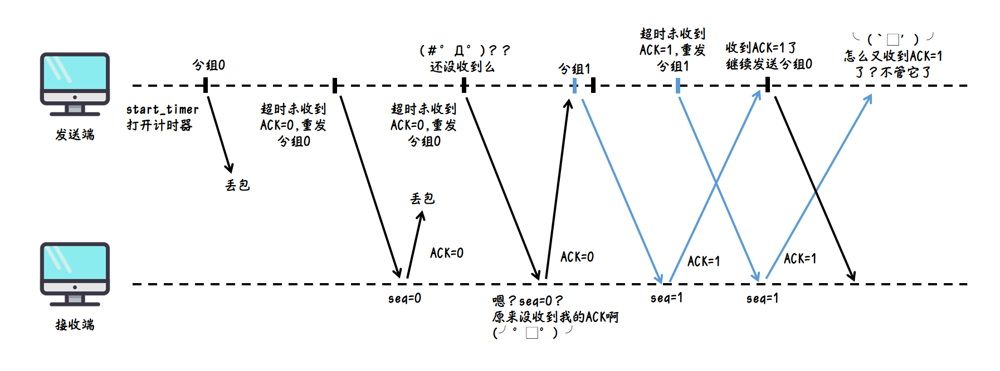
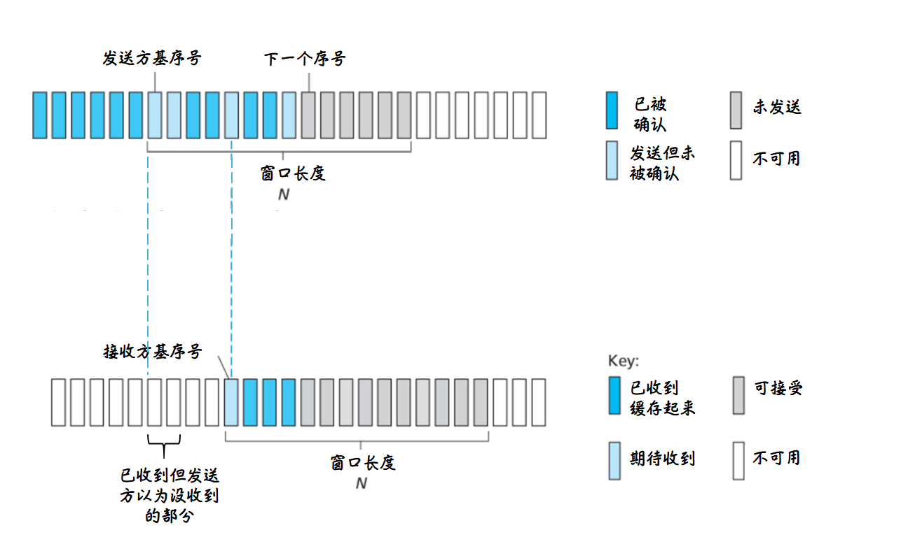
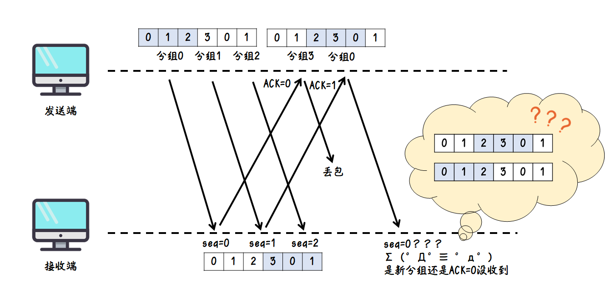
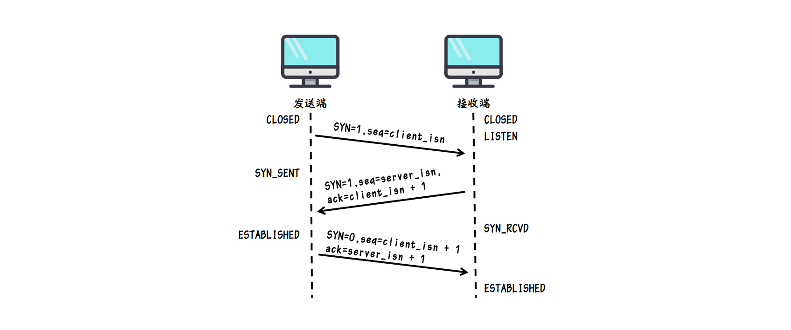
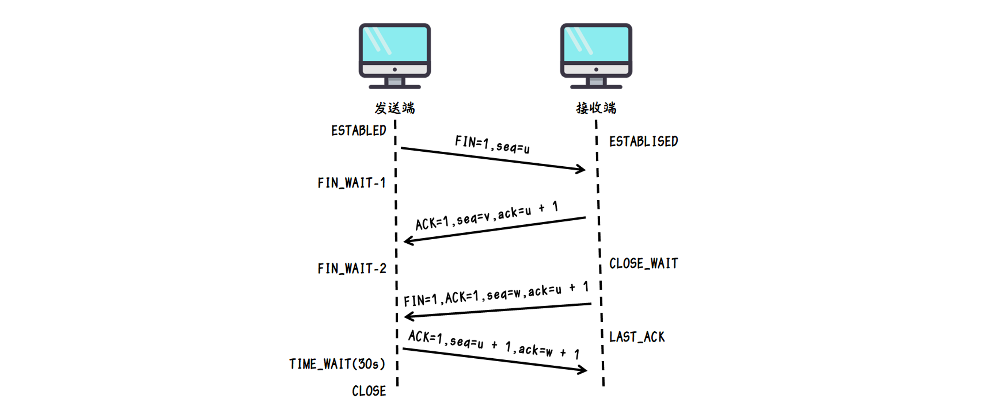
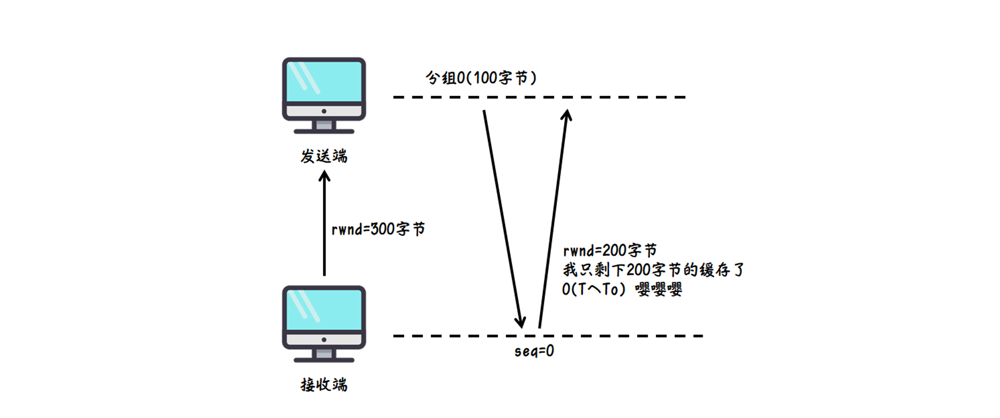
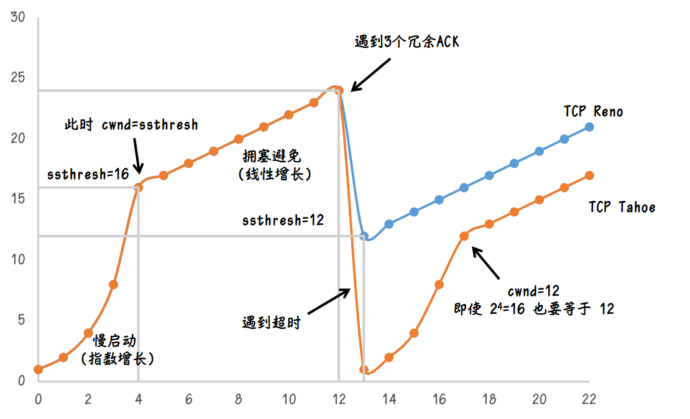

- `通信子网` 物理层、链路层、网络层

- `资源子网` 会话层、表示层、应用层

- `网络层` 提供 `尽力而为` 的服务

  - 不保证交付

  - 不保证按序交付

  - 不保证数据完整

  - 不保证延迟

  - 不保证带宽

- `传输层` 能通过 `差错恢复` `重排序` 等手段提供可靠、按序交付服务

  - 不保证延迟

  - 不保证带宽

- TCP/UDP 解决两台计算机 `进程` 间的通信, IP 解决两台计算机间的通信 

## 套接字

- `复用` 传输层从多个套接字中收集数据, 交给网络层

- `分用` 传输层从网络层收到数据, 交付给正确的套接字

- `端口号` 是套接字标识的一部分

  - `未指定` 端口号时, 操作系统自动从 `49152~65535` 中分配(动态/私有端口)

  - 使用 `公共域协议` 时分配端口号 `0~1023`

  - 注册端口号 `1024~49151` 需要向 IANA 注册才能使用

## UDP

`用户数据报协议`

:::info 应用场景

资源少, 丢包不敏感的, 如视频聊天, 直播, 域名解析

不存在拥塞控制, 因此广泛应用于实时应用

:::

- `UDP` 套接字由二元组 `<目的IP, 目的端口号>` 标识

- 支持 `一对一` 、`一对多` 、`多对一` 和 `多对多` 的交互通信

- 提供进程到进程间的 `报文交付`

- 提供 `复用/分用` 服务

- `UDP` 相比 `TCP` 具有的 `优势`

  - `TCP` 存在重传及拥塞控制机制, `UDP` 能更好的控制发送的数据和发送时间, 因为它不限制速率

  - `UDP` 不建立连接, 不引入建立连接的 `时延`

  - 分组首部开销小, `UDP` 头部仅 `8` 字节

- `UDP` 数据报最大长度 `2^16=65536` 字节

### 差错检验

- 校验和先由 `0` 代替, `求和` 结果 `取反` 得到校验和

- 超过 `16` 的部分 `回卷` (最后的进位加到末尾)

- 接收方进行 `求和` 操作, 无差错的情况下应为 `1111111111111111`

- `UDP` 无法对差错进行修复, 要么丢弃要么向应用层发出警告

:::tip UDP 长度

伪首部只用于计算校验和, 不计入 UDP 长度, 不发送, UDP 数据报首部长度(8B)和数据长度计入 UDP 长度

:::

## 可靠传输协议

### rdt1.0

`理想模型`

### rdt2.0

`差错检验`

- `停等协议` 处于等待 `ACK` 或 `NAK` 的状态时不能从上层获得更多的数据

- 此协议未考虑 `ACK` 或 `NAK` 存在差错

  - 可以给 `ACK` `NAK` 加上 `检验和` , 使得发送方能够对错误进行 `恢复`

  - 也可以让发送方重传分组, 但由于接收方不知道 `ACK` 或 `NAK` 是否被发送方正确接收, 因此不知道接收的分组是 `重传` 的还是 `新的` , 可能在信道中引入 `冗余` 分组

### rdt2.1

发送端将分组编号和 ACK/NAK 加上检验和

- 接收方接收的分组序号是 `0` 时, 若数据未损坏, 期望分组是 `1` 时, 说明期望收到新分组, 但是却收到重传的, 需要再发一次 `ACK` 表明收到, 若期望分组是 `0` , 说明期望是重传的分组, 因此要发送 `ACK`

- 接收方和发送方的状态数是之前的 `2` 倍, 因为不仅要判断收到的是 `ACK/NAK` , 还要判断收到的分组序号是 `0` 还是 `1`

- 如果数据不出错, 其分组应该按照 `0 1 0 1 0 1...` 的顺序推进

### rdt2.2

无 `NAK` 可靠传输

- 假设发送方发送了分组 `0`

- 接收方收到的分组序号是 `0` , 其期望分组也是 `0` 时, 若数据未损坏, 发送 `ACK=0` , 说明分组收到

- 当接收方收到受损分组, 其期望分组是 `0` , 上次收到的分组是 `1` , 则发送 `ACK=1` , 发送方收到两个连续相同的 `ACK=1` , 说明此次发送的分组 `0` 未被收到, 重新发送分组 `0`

- 接收方期望是 `0` , 收到重传分组 `0` 时, 发送 `ACK=0` , 同时期望分组变成 `1`

- 如果发送方收到损坏的数据, 无论 `ACK` 等于多少, 直接重发分组 `0`

### rdt3.0

`比特交替协议`

加入定时器, 根据等待时间判断是否需要 `重传`

## 流水线协议

解决信道利用率低的问题, 分组序号由 `0` 和 `1` 扩大至 `0~N`

### 回退 N 步协议 ( GBN )

`滑动窗口协议`

- `累积确认` 当收到 `ACK=n` 时说明 `序号≤n` 的都被正确收到了

  - 接收方只按序接收分组, 不按序的都会丢弃

  - 不必对所有分组发送 ACK, 而是对按序收到的所有帧的最后一个帧发送确认报文

  - 数据按序交付至上层, 失序分组会被 `丢弃` , 并且重新传送出错帧及 `以后` 帧

  

  

- 接收窗口为 `1`

- 序列号至少比窗口大 `1`

  

- 序号为 `n` , 发送窗口最多可以为 `n-1` 才能保证按序接收

  

### 选择重传 ( SN )

- 失序部分会先缓存起来, 等到前面分组来了就滑动窗口

- 只重传出错帧或计时器超时帧

- 窗口长度(如下图为 `3` )必须小于等于序号数的一半(如下图序号数至少 `6` , 但是只有 `4` )

  当接收方收到分组 `0` 时, 不知道是新的分组, 还是由于前面一次 `ACK=0` 没有收到而发送方重传的分组 `0`

  

  

- 定时器只有 `1` 个, 重传分组 `n` , 若在定时器结束前 `ACK=n+1` 到达了, 则在 `ACK=n` 到达后不会重传 `n+1`

:::tip 丢包后不一定重传的原因

发送方发了两个报文段, 接收方都收到了, 会发送两个确认报文, 低序号的报文确认丢失了, 但收到了高序号的报文确认, 就可以认为之前的数据报都收到了, 因此不必重传低序号的报文段

:::

## TCP

`传输控制协议`

:::info 应用场景

电子邮件, 文件传输, 消息传输

特点: 面向连接, 全双工, 字节流, 可靠交付

:::

- `TCP` 套接字由四元组 `<目的IP, 目的端口号, 源IP, 源(监听)端口号>` 标识

- 伪首部中协议字段为 `6`

- 一个端口可以监听来自 `多个` 客户端的 `TCP` 请求, 但每个请求都会建立一个临时端口建立连接

- 同一个分组的超时间隔在一个周期结束后加倍

- 初始超时时间由 `EstimatedRTT` 和 `DevRTT` 推算

  - 出现重传时会将下一次超时时间间隔变成原来的 `两倍`

- 接收端允许收到若干报文段后发送一个累计确认报文

  - 推迟确认的时间最多 `500ms`

  - 推迟确认造成 `RTT(往返延迟)` 计算不准确

- 最大段长度(MSS), 缺省时为 `536` 字节

- 滑动窗口的作用是 `流量控制` , 重传分组的大小为滑动窗口大小

### 报文

首部长度以 `4B` 为一个单位

- `序列号` 数据分组第一个字节的编号

  

- `确认号` 期望收到下一个报文段数据部分的第一个字节编号 ( 确认号为 `n` , 说明最后一个字节编号为 `n-1` 的报文段已经收到, 报文段里面有许多个字节编号 )

- `紧急位(URG)` `URG=1` 表示紧急指针字段有效

- `确认位(ACK)` `ACK=0` 确认号无效

- `推送位(PSH)` `PSH=1` 表示尽快向上交付数据, 不会等缓存满了再上交

- `复位位(RST)` `RST=1` 表示必须释放连接

- `同步位(SYN)` `SYN=1` 表示连接请求/接收

- `终止位(FIN)` `FIN=1` 表示释放连接

### 冗余 ACK

当收到失序分组时会发送丢失部分的上一个分组序号, 收到超过 `3` 个相同的 `ACK` 时启动 `快速重传 `

### 三次握手

- 客户端向服务端发送一个特殊的 `TCP` 报文

  - 包含 `SYN=1` `ACK=0`

  - 起始序列号 `seq` , 基于 `时钟` 选取, 每个主机上有个时钟, 每隔 `ΔT(4μs)` 时间计数加一, 新建一个连接时取计数器的 `32位` 作为起始序号

- 服务端向客户端发送允许连接报文

  - 包含 `ACK=1` `SYN=1`

  - 确认序列号 `ack` 为上一次发送序列号加一

- 客户端确认连接, 由于连接已经建立, 因此 `SYN=0` `ACK=1`

:::info 为什么不能两次握手?

客户端发送连接请求可能由于网络堵塞处于等待状态, 重新又发送了一次, 等到连接结束后第一次发送的请求又到了服务端, 如果只有两次握手, 就会让服务端一直处于等待状态

:::

ack=xx 可以理解为 “我期待序号为 xx 的数据包”, 因此发送成功的话下一次就会请求 ack = xx + 1

#### SYN 泛洪

- 服务器收到 `SYN` 后一般超过 `30~120s` 没有收到 `ACK` 就丢弃未完成连接

- 攻击者向服务器发送大量 `SYN` 而没有 `ACK` , 导致服务器维护一个巨大的半连接表

### 四次挥手

- `time_wait` 具体长度为 `2MSL` , 即去向 `ACK` 存活时间 + 来向 `FIN` 存活时间

  - 保证客户端发送的 `ACK` 和服务端发送的 `FIN` 在网络中消失

:::info 为什么要客户端最后要等待一段时间才关闭?

防止服务端收不到客户端最后的确认报文而重新发送时客户端由于关闭了又收不到, 这个等待时间是两倍的报文最大存活时间, 因此服务端如果收不到最后一次报文就一定会在等待时间内重传, 这样客户端重传等待时间又会重置
:::

## 流量控制

- `接收窗口(rwnd)` 由接收端控制

  

  - 接收缓存中的数据未被及时取走, 后续数据可能会 `抛弃`

  - `接收方` 会把窗口大小放到报头中告知发送方可用空间

  - `发送方` 需要调节发送速率, 接收窗口为 0 时发送方要立即停止发送

- `拥塞窗口(cwnd)` 由发送端控制

- `发送窗口` `min(cwnd,rwnd)` 由接受方的接收窗口和拥塞窗口控制

### GBN/SN/UDP 不需要流量控制?

- `GBN` 拿到正确、按序的分组就会立即交付, 占用缓冲区立即释放

- `SN` 通过确认序号可以得知还可以接收多少分组

- `UDP` 不可靠, 丢了就丢了

### 非零窗口通告

- TCP 在下述三种情况下才能发送报文

  - 收到数据或需要确认

  - 应用程序调用

  - 超时

- 发送方因为接收窗口为 `0` 而停止发送, 当接收方的接收窗口不为 `0` 后会因为没有收到数据而无法发送 `非零通告`

- 发送方可以发送一个 `零窗口探测` 报文获取窗口大小

### 糊涂窗口

- 接收方消费慢, 发送方发送快

- 零窗口探测过后, 接收方每次发送一个很小的窗口通告, 因此发送方每次只能发送很小的数据, 发送方带宽浪费

- `接收方启发式策略` 只有当窗口大小 `显著增加` 时(达到缓存的一半或一个 MSS)才通告新窗口大小

- `发送方启发式策略` 发送方积聚足够多数据才发送

  - `Nagle算法` 在确认报文到达前尽可能收集要发送的数据组成一个大的 TCP 段

## 拥塞控制

### 慢开始(慢启动)

- 起始拥塞窗口设置为最大分段大小 `cwnd_0 = MSS`

- 报文被确认后增加一个 `MSS` , `cwnd_n = MSS^{n+1}`

  :::info

  这里 1 个报文被确认窗口变成 2 , 2 个报文被确认窗口就变成 4 , 依次类推, 每过一个 RTT, 窗口呈指数增长

  :::

- 当存在 `1` 个由 `超时` 指示的 `丢包` 事件时

  - 窗口大小变成 `1` , 即 `cwnd = MSS(Tahoe)`

  - 慢启动阈值减半 `ssthresh=cwnd/2`

- 当 `cwnd_n=ssthresh` 进入 `拥塞避免`

- 当存在 `3` 个冗余 `ACK` 时, 进行 `快速重传(Reno)`

### 拥塞避免

`cwnd_n = cwnd_{n-1} + MSS`

### 快速恢复

出现 `3` 个冗余 `ACK` 后 `ssthresh=cwnd/2` , `cwnd=ssthresh+3` , 然后进入拥塞避免

:::info

超时和 3 个冗余包是不一样的, 虽然都是丢包, 但是超时说明网络交付能力很差, 而 3 个冗余包说明网络仍然可以进行交付

:::

