## 概述

### 性能指标

- `存储容量` 存储字数 × 字长, 如 `1M×8bit`

- `存储速度`

  - `存取时间` 启动存储器操作到完成操作的时间

  - `存取周期` 进行一次完整的读写操作所需时间

  - `主存带宽` 数据传输率, 每秒从主存进出的信息量

- `单位成本`

### 分类

- 存储介质

  - 磁存储器 `磁芯` `磁盘` `磁带`

  - 半导体存储器 `TTL` `MOS`

  - 光存储器 `CD-ROM` `DVD-ROM`

- 存取方式

  - 随机存储器 `RAM` 随机读写, 类似 `数组` , 读写方便

  - 顺序存储器 `SAM` 依地址顺序访问, 类似 `链表` , 存取速度慢

  - 直接存储器 `DAM` 数据通过 `通道` , 不经过CPU, 直接与设备交互

- 可改写性

    1. 读写存储器 `RWM`

    2. 只读存储器 `ROM` 断电后可保存数据

- 功能

  - 寄存器 `register`

  - 高速缓冲 一般使用 `SRAM`

  - 主存 一般使用 `DRAM`

  - 外存储(辅助存储器)

### 多层存储系统

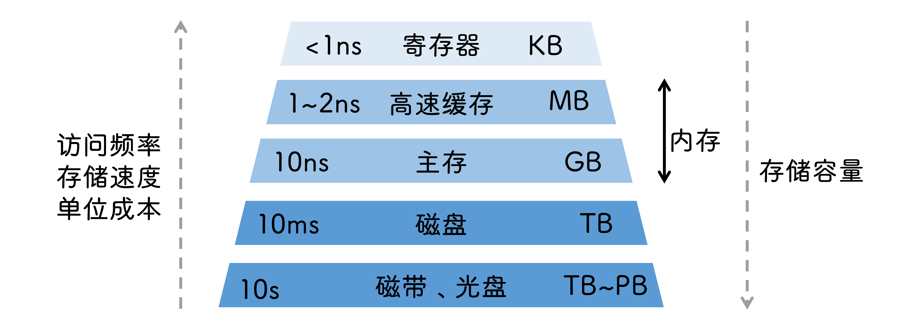

## 主存

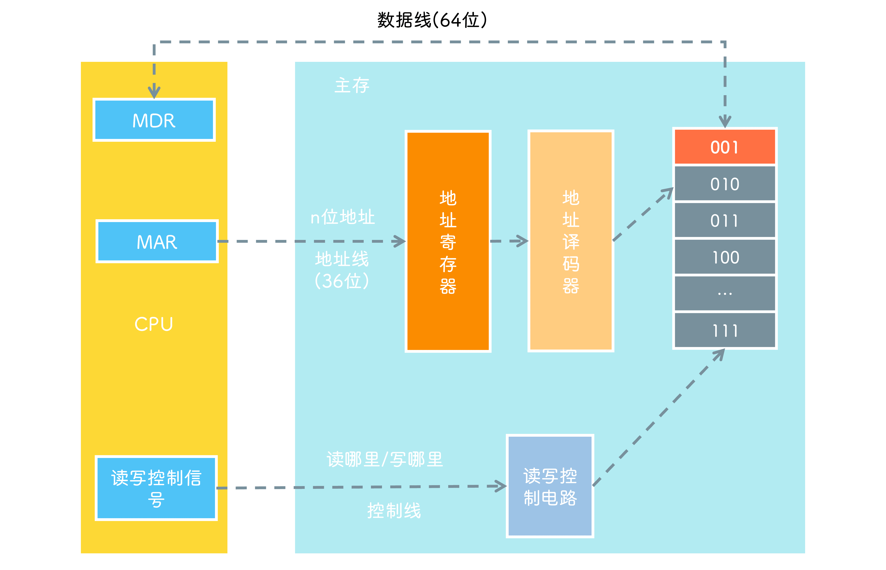

### 大端小端

- `小端` 低字节地址存放在数据低字节部分

- `大端` 低字节地址存放数据高字节部分, 更符合人类思维

### 边界对齐

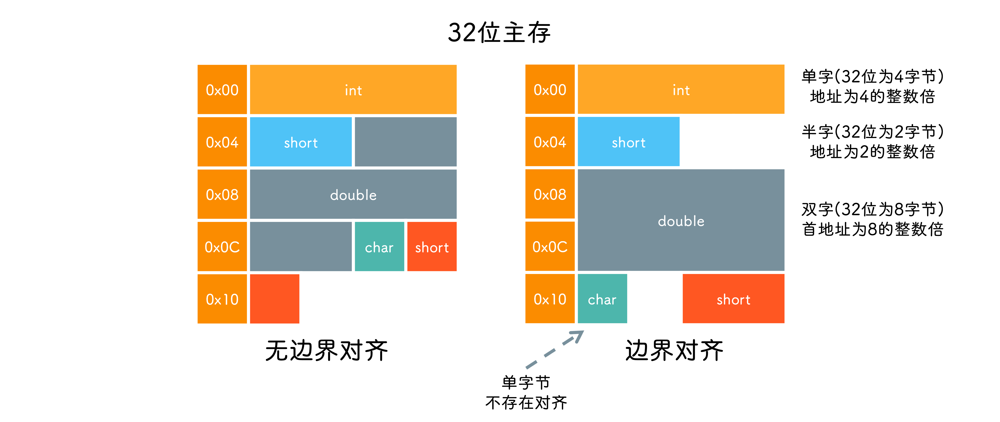

### SRAM

- 双稳态 `触发器` 实现记忆信息

- 非破坏性读出

- 存储速度快

- 集成度低, 功耗大, 一般用于 `高速缓存`

### DRAM

- 栅极 `电容` 上的电荷存储信息

- 易集成, 功耗低, 容量大, 一般用于 `主存`

- 电容充放电过程慢, 因此速度慢

- `地址复用`

  - 芯片引脚个数取决于行地址线和列地址线中的 `较大值`

  

- `引脚数` = 地址线 / 2 + 数据线 + 行选通 + 列选通 + 读写控制

#### 刷新

- 按 `行` 刷新

- `集中刷新` 最后 `64μs` 集中进行刷新 `128` 次

  - 优点: 读写操作不受刷新工作影响

  - 缺点: 刷新阶段不能访问存储器, 称为 `死区`
  
  

  

- `分散刷新` `2ms` 内刷新 `2000` 次

  - 优点: 没有死区

  - 缺点: 加长存取周期, 降低整机速度

  

- `异步刷新` `2ms` 内刷新 `128` 次

  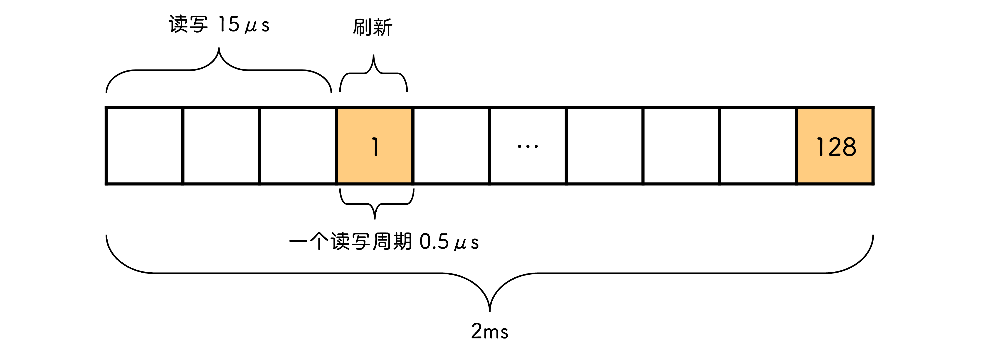

### ROM

- 结构简单, `位密度` 比可读写高

- 非易失性, 可靠性高

## 与 CPU 连接

### 连接原理

- `数据总线` 位数与工作频率的乘积正比于 `数据传输率`

- `地址总线` 位数决定了 `可寻址` 的最大内存空间

- `控制总线` 指出总线周期类型和本次输入/输出操作完成时刻

- `ROM` 仅存在 `片选` 信号线

- `SRAM` 存在片选信号线 `CS` 和读写控制线 `WR` (低电平有效)

### 扩展

:::info
`ak×b位` 表示有 `ak` 个地址, 数据线有 `b` 条
:::

#### 位扩展(增加数据传输量)

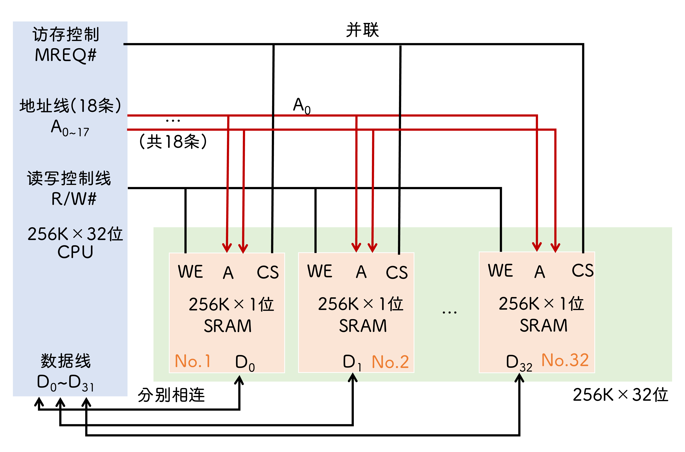

#### 字扩展(增加地址数)

根据需要组装的存储器个数决定使用何种译码器

如下图需要组装 `8` 个存储器, 因此使用 `3:8` 译码器, 若仅扩展 `2` 倍, 可以使用 `非门`

`No.1` 的地址范围 `000|00000000000000000~000|11111111111111111`

`No.8` 的地址范围 `111|00000000000000000~111|11111111111111111`

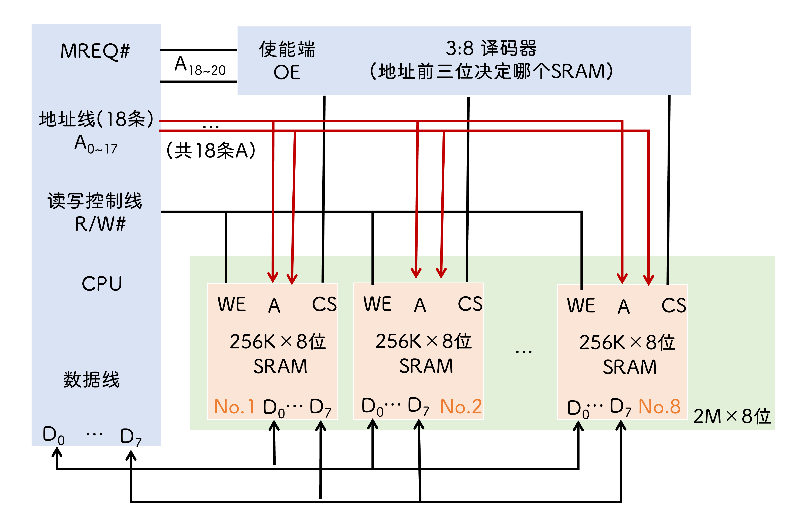

#### 字位同时扩展

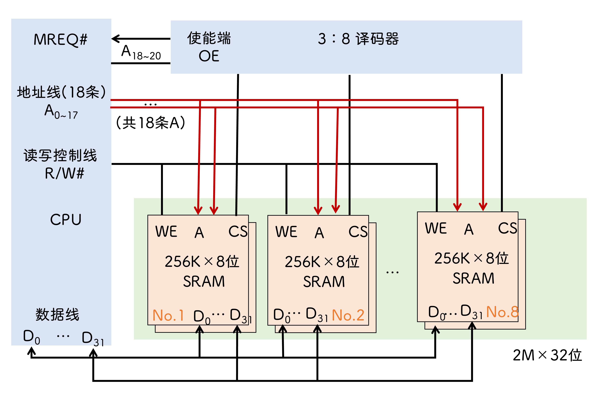

### 合理选择芯片

- ROM: 系统程序区、标准子程序、常数
- RAM: 用户程序, 系统程序工作区

## 多模块存储器

### 单体多字存储器

#### 联动模式(双通道内存)

两个模块中地址相同的数据 `合并` 传送给 CPU, 带宽提升 `2` 倍

#### 非联动模式

两个模块可以 `并发` 工作

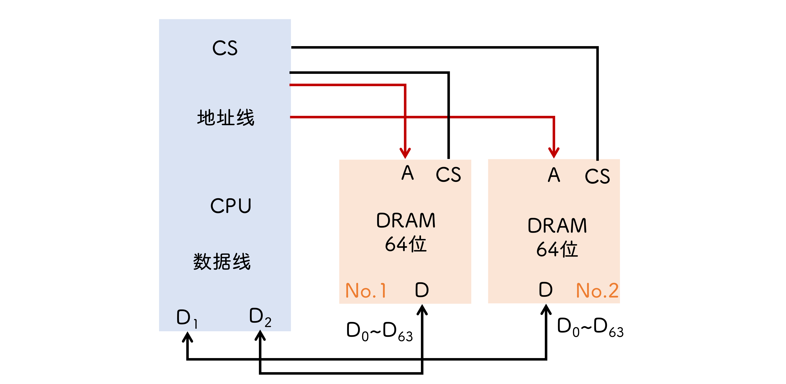

### 多体交叉存储器

#### 高位多体交叉

高位地址选模块, 低位地址选单元

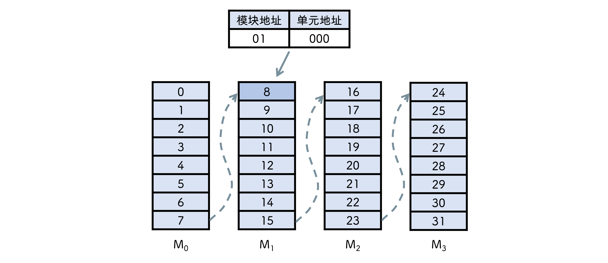

#### 低位多体交叉

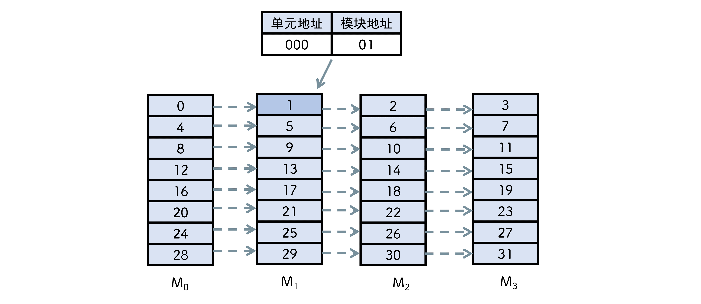

#### 比较

- 低位多体交叉各个模块相互独立, 可以采用 `流水线模式` 读写
  
  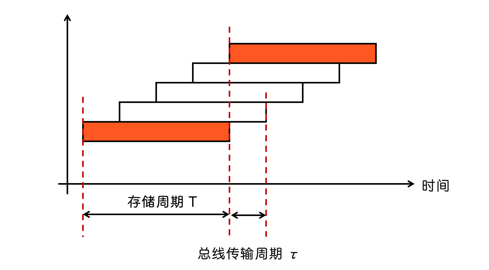

- 高位多体交叉只能先读完一个再读下一个

  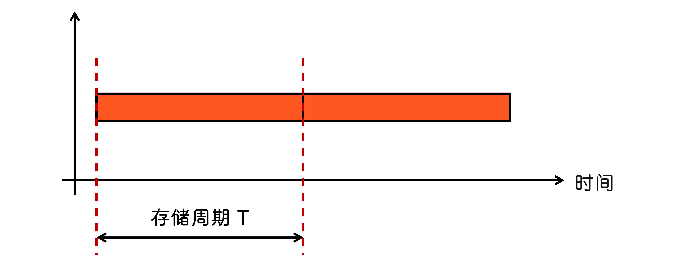

## cache

:::info
CPU 与 cache 以 `字` 为单位传输信息, cache 与主存以 `块` 为单位传输信息
:::

### 程序访问的局部性原理

- `时间局部性` 最近未来要用到的信息, 很可能是现在在使用的信息

- `空间局部性` 最近未来要用到的, 很可能与现在正在使用的在存储空间上是邻近的

### 基本过程

#### 写操作

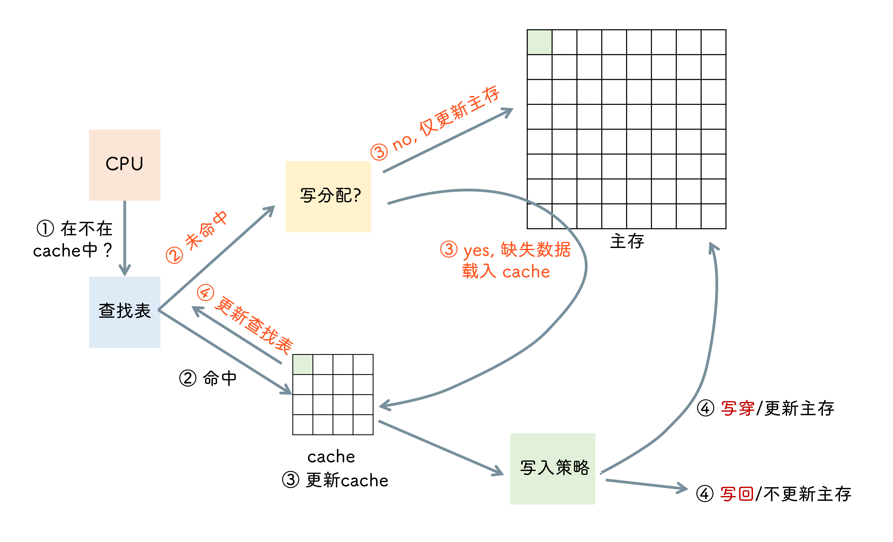

#### 读操作

#### 命中率

h＝访问 cache 次数 / 访问主存次数 ＝ Nc / (Nc + Nm)

#### 平均访问时间

t = (1 - h) × t(未命中访问时间) + h × t(命中访问时间)

#### 访问效率

e = 访问 cache 时间 / 平均访问时间

### 映射方式

#### 直接相联映射

- 只能映射到固定行

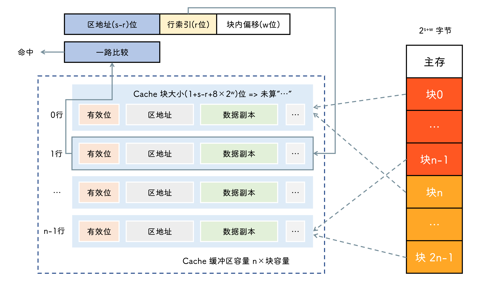

#### 全相联映射

- 一个主存块可以映射到任意 cache 块中

- 只要有空行就可以存放

- 只要有空行就不会产生冲突

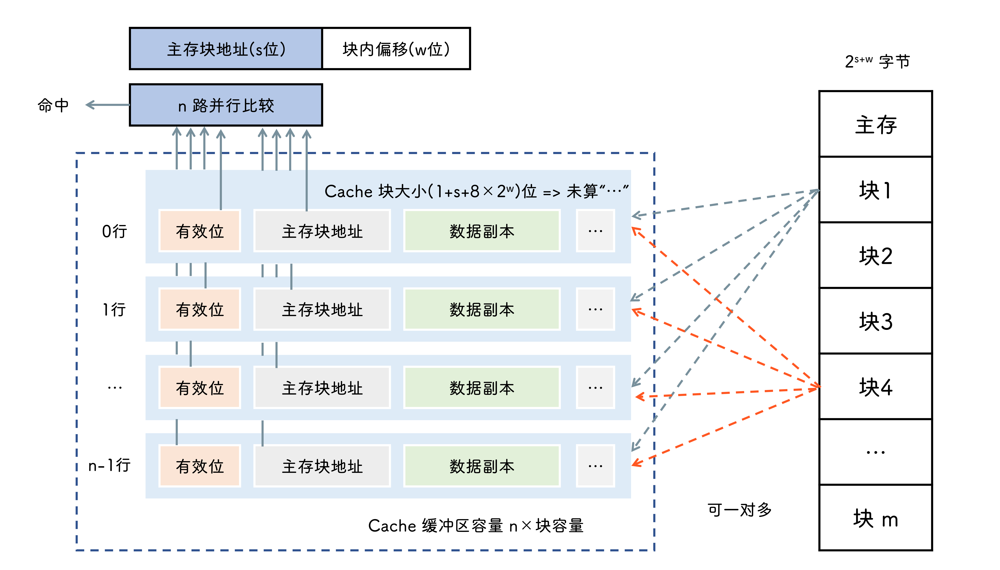

#### 组相联映射

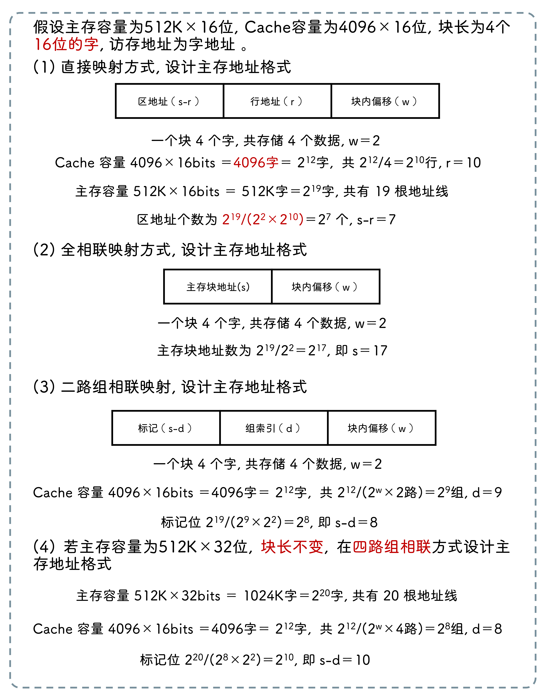

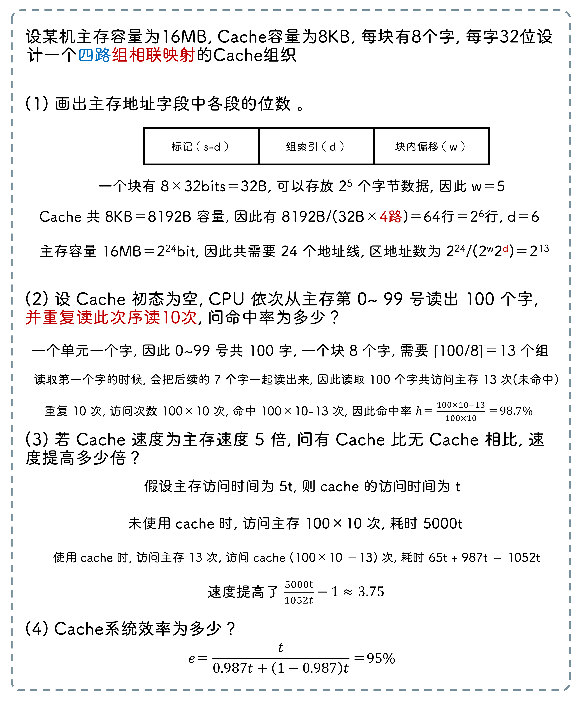

### 替换算法

- `先进先出(FIFO)` 需要 `时间戳` 比较先后顺序(队列), 一些经常使用的块可能被替换
    
- `最不经常使用(LFU)` 需要 `淘汰计数器` , 计数器数值大的保留(优先队列), 一些经常使用的块比之前经常使用但现在不用的使用次数少可能会被淘汰
    
- `近期最少使用(LRU)` 需要 `计数器` , 使用过一次该块计数器清零, 其他块计数器加 1

- `随机替换`

### 写策略

- `写回(WB)`

   - 当该数据从 cache 中 `被替换` 时才去更新主存

   - 每一行存在一个 `脏位` , 被修改过标识为 `1`

   - 减少写入慢速主存的次数

   - 导致直接存储器访问到的数据不是最新的

- `写穿(WT)` `直写法`

   - 同时对主存和 cache 进行修改

   - 被替换时 cache 数据可以直接丢弃

   - `多核` 时无法保证其他 CPU 的 cache 数据是最新的

## 虚拟存储器

### 地址划分

- 虚拟页号的位数决定页表项的数目(有多少页)

- 虚拟页偏移的位数决定页大小(一页有多少字节)

### 页表

- `交换分区` 存放主存页面换出的动态修改数据

- `数据分区` 存储用户程序和数据

- `使用位` 配合替换策略(FIFO等)

- `有效位` 为 `1` 表示页面 `在主存中`, 为 `0` 表示 `未分配` 或者页 `在磁盘` 中(访问需要加载到主存中)

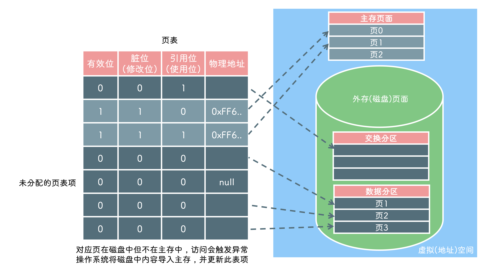

### 地址转换过程

虚拟地址通过 `PTBR` 转换成页表项地址, 表项中存放着物理地址

### 结合 cache

### 快表

缓存页表项

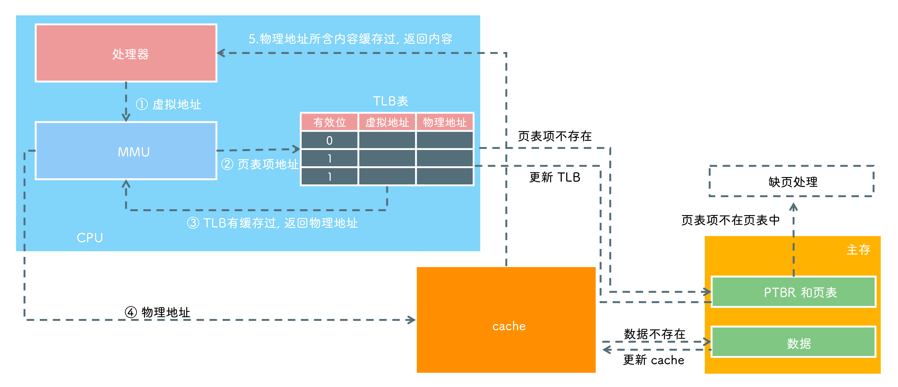